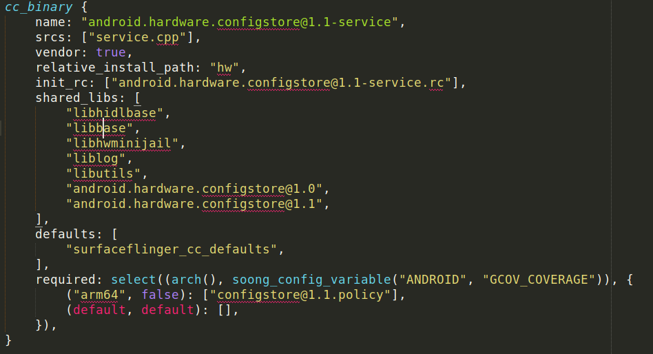
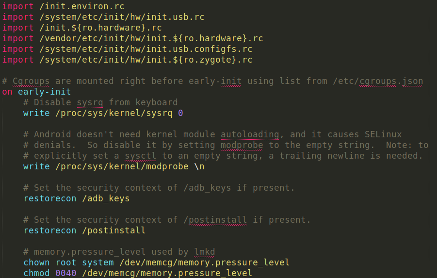
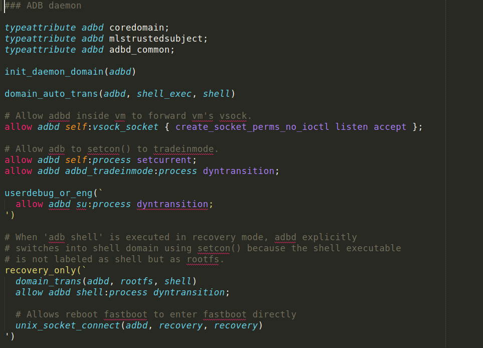

# Sublime Text Android Syntax

Sublime Text syntax highlighting for Android Open Source Project (AOSP) files.

### Android Blueprint (`.bp`)

-   **Accurate Highlighting**: Clearly distinguishes between module types, properties, variables, and language constructs like lists, maps, and `select` statements.
-   **Enhanced Code Navigation**: Enables **Go to Symbol** for module definitions and **Find References** for module usages.
-   **Intelligent Word Handling**: Correctly treats module names with hyphens (`-`) and dots (`.`) as single, complete tokens.

### Android Init (`.rc`)

-   **Clear Structure**: Highlights `on`, `service`, and `import` sections, along with all standard triggers, commands, and service options.
-   **Argument Scoping**: Differentiates between paths, numbers, user/group names, and other arguments for improved readability.
-   **Full Syntax Support**: Correctly handles comments, line continuations, and property expansions.

### SELinux (`.te`)

-   **Comprehensive Rule Highlighting**: Recognizes all major rule types, including `allow`, `neverallow`, `dontaudit`, `type_transition`, and extended permissions (`allowxperm`).
-   **Full Declaration Support**: Correctly scopes `type`, `attribute`, `class`, `role`, `bool`, and other declarations.
-   **Advanced Constructs**: Understands sets (`{}`), the `self` keyword, conditional `if`/`else` statements, and constraints.
-   **M4 Macro Awareness**: Highlights M4 macro definitions and calls, which are heavily used in Android's policy files.
-   **Enhanced Code Navigation**: Enables **Go to Symbol** for declarations (types, attributes, macros, etc.) and **Find References** for their usages.

---

This is not an officially supported Google product. This project is not
eligible for the [Google Open Source Software Vulnerability Rewards
Program](https://bughunters.google.com/open-source-security).
